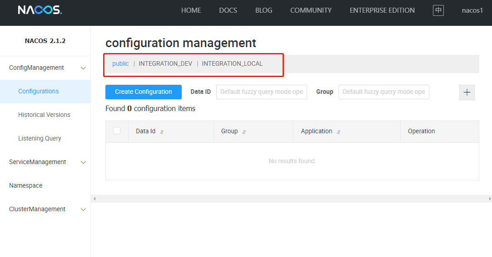
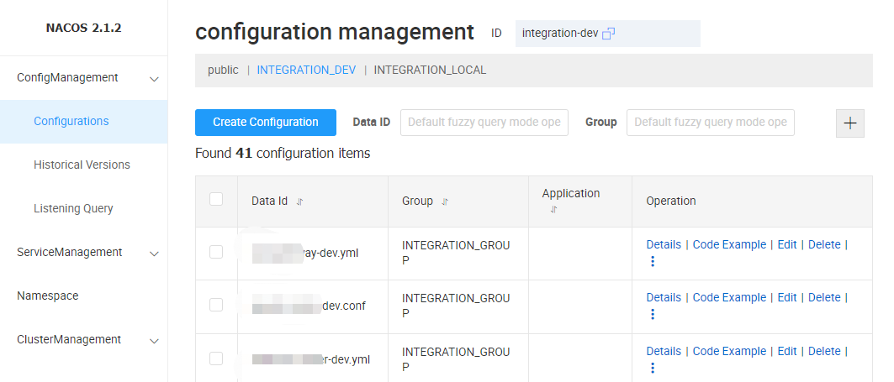
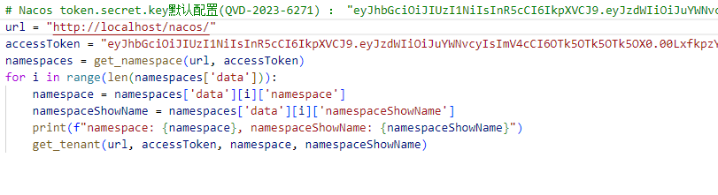
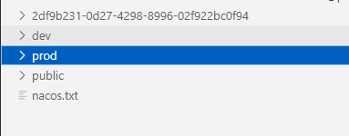

# 简介

在hvv行动中经常遇到nacos，从利用上来看还是翻看configurations内的配置文件。少一些还行，如果比较多的话，来回点编辑然后返回太麻烦了，还容易遗漏。所以简单写个脚本下载configuations

# 自动下载 nacos 配置文件

## 配置

一般只需要修改url就行，accessToken使用的是nacos默认值，根据实际情况修改

保存文件一般采用的是namespace参数值，如果该值为空，就会使用namespaceShowName的参数值。不过无所谓什么名字，下载下来之后丢vscode翻起来就方便多了

